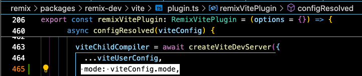

# Migrate Remix to Vite

- the current @remix-run/dev repo has a configuration for the vite plugin which will cause an error in the build for mdx; this repo has a 'build' and public/build directory which is pre-compiled/pre-built and it will work; for ongoing projects, you'll need to wait for the update or pull down the remix monorepo, make the edit in the createViteDevServer function yourself, build it and then insert the 'dist' folder of build/@remix-run/dev into your node_modules

```ts
viteChildCompiler = await createViteDevServer({
          ...viteUserConfig,
          mode: viteConfig.mode,
```


